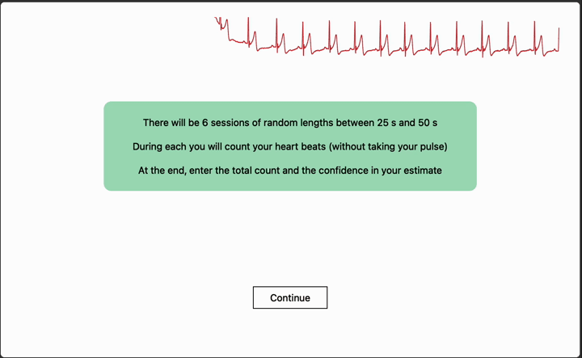
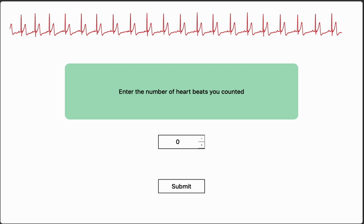
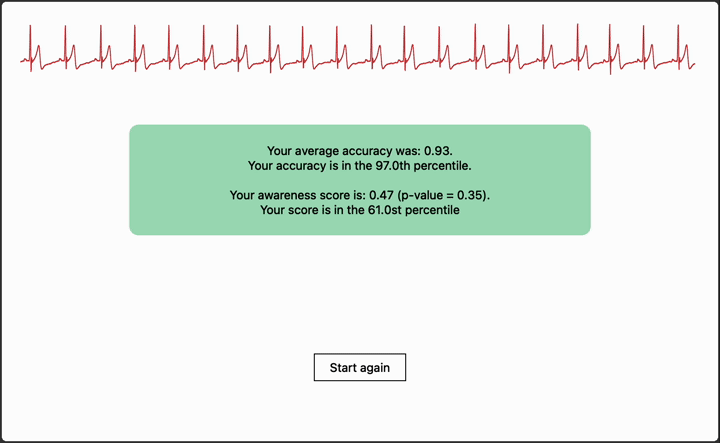

# Total Eclipse of the Heart – Improve your interoceptive awareness with a Heart Rate Monitor

The awareness of a person's own heartbeat, measured by counting heart beats without taking a pulse, plays a role in a person's ability to process emotions and regulate pain. This application allows you to assess heart beat detection accuracy and awareness using a widely available Polar H10 Heart rate monitor, and compare results against the data from a major study on interoceptive awareness.

Interoceptive awareness, the ability to identify sensations of the internal state of the body, has gained recent attention in psychology and cognitive science. The way in which the body is represented in the mind has been found to play a role in decision making, emotional regulation, memory, and a person's sense of self. Recent studies on mindfulness have also found that practises focused on developing a non-reactive attitude towards internal sensations (e.g. body scan techniques) may help to re-train the attitude a perons has towards interoceptive signals, methods that have had success a alleviating maladaptive patterns like anxiety.

A simple and widely used method for measuring interoceptive accuracy is the Heatbeat Detection Task, where people are asked to counted their heart beat over a period of time by focussing internally. Two metrics are then calculated, accuracy, how well their estimate corresponded with the ground truth, and awareness, how well the accuracy corresponding with their self-reported confidence. 

## Features

- Connect and stream ECG data from a Polar H10
- Progress through heart beat detection trials, entering heartbeat count estimates and confidence as ground truth is measured
- Review heart beat detection accuracy and awareness over multiple trials using the protocol from the widely cited paper on interoceptive awareness *Knowing your own heart: Distinguishing interoceptive accuracy from interoceptive awareness. Garfinkel et. al.*
- Compare results against the dataset collected across 80 research participants
- Save out session data

## Installation and usage
    
    python -m venv venv
    source venv/bin/activate  # On Windows, use `my_project_env\Scripts\activate`
    pip install -r requirements.txt
    python HeartbeatDetection.py 

The program will automatically connect to your Polar device. Follow the steps on the screen.

Follow your ECG signal which traces across the top of the screen to see you've got a good signal

Begin a trial, counting your heart beats to yourself, without taking your pulse

At the end of the trial, enter the number of beats you counted, then indicate on the sliding scale how confident you were in your estimate

Repeat this for six trials, between 25 and 50 seconds. 

Review your average accuracy score, and your awareness score – how well your confidence aligned with your performance.

Compared your scores against the 80 participants of the original research study.

## Contributing
Feedback, bug reports, and pull requests are welcome. Feel free to submit an issue or create a pull request on GitHub.
